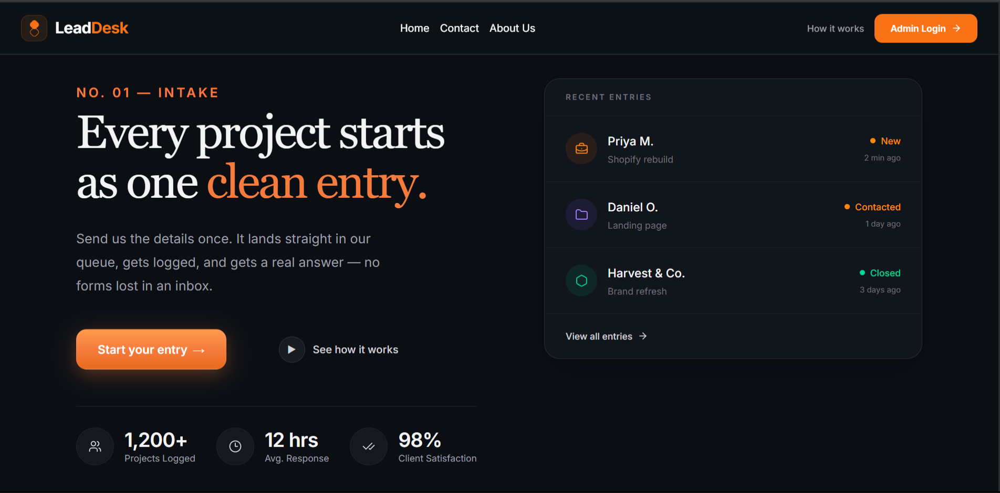

# LeadDesk

A full-stack Lead Management System built using React, Express.js, and MongoDB. The application enables administrators to securely manage customer leads through a modern dashboard with authentication, search, filtering, and status tracking.

---

## 📖 Overview

LeadDesk was developed as a full-stack internship assignment to demonstrate the ability to build and deploy a production-ready MERN application.

The application allows users to submit lead information while providing administrators with a secure dashboard to manage, search, filter, and update leads efficiently.

---

## ✨ Features

### Public Features
- Submit new customer leads
- Responsive landing page
- Form validation
- Modern UI built with Tailwind CSS

### Admin Features
- Secure admin authentication
- Dashboard for viewing all leads
- Search leads by name or email
- Filter leads by status
- Update lead status
- Delete leads
- Session persistence using cookies
- Protected routes

---

## 🛠 Tech Stack

### Frontend
- React 18
- Vite
- Tailwind CSS
- JavaScript (ES6+)
- Lucide React

### Backend
- Node.js
- Express.js
- MongoDB Atlas
- Mongoose
- JWT Authentication
- Cookie Parser

### Deployment
- Frontend: Vercel
- Backend: Render
- Database: MongoDB Atlas

---

## 🌐 Live Demo

Frontend:
https://your-vercel-url.vercel.app

Backend API:
https://your-render-url.onrender.com

GitHub Repository:
https://github.com/UTRINO-UTKARSH/LeadDesk

---

## 📁 Project Structure

```text
LeadDesk
│
├── LeadDesk_client
│   ├── src
│   │   ├── components
│   │   ├── pages
│   │   ├── assets
│   │   ├── App.jsx
│   │   └── main.jsx
│   ├── public
│   └── package.json
│
├── backend
│   ├── Controllers
│   ├── middleware
│   ├── models
│   ├── routes
│   ├── lib
│   ├── index.js
│   └── package.json
│
└── README.md
```

---

## 🏗 Architecture

```text
                User

                  │

                  ▼

     React Frontend (Vercel)

                  │

        REST API Requests

                  │

                  ▼

 Express Backend (Render)

                  │

             Mongoose ODM

                  │

                  ▼

        MongoDB Atlas Database
```

---

## 🚀 Installation

### Clone Repository

```bash
git clone https://github.com/UTRINO-UTKARSH/LeadDesk.git

cd LeadDesk
```

---

## Backend Setup

```bash
cd backend

npm install
```

Create a `.env` file

```env
PORT=5000

MONGODB_URI=your_mongodb_connection_string

JWT_SECRET=your_secret_key

CLIENT_URL=https://lead-desk-8zsf.vercel.app/ 

NODE_ENV=development
```

Run backend

```bash
npm run dev
```

---

## Frontend Setup

```bash
cd LeadDesk_client

npm install
```

Create a `.env`

```env
VITE_API_BASE=https://lead-desk-8zsf.vercel.app/
```

Run frontend

```bash
npm run dev
```

---

## 📡 API Endpoints

### Authentication

| Method | Endpoint | Description |
|---------|----------|-------------|
| POST | `/api/auth/login` | Admin Login |
| POST | `/api/auth/logout` | Logout |
| GET | `/api/auth/check` | Verify Authentication |

---

### Leads

| Method | Endpoint | Description |
|---------|----------|-------------|
| GET | `/api/leads` | Get All Leads |
| GET | `/api/leads/:id` | Get Lead |
| POST | `/api/leads` | Create Lead |
| PATCH | `/api/leads/:id` | Update Status |
| DELETE | `/api/leads/:id` | Delete Lead |

---

### Users

| Method | Endpoint | Description |
|---------|----------|-------------|
| GET | `/api/users` | Get Users |
| POST | `/api/users` | Create User |
| PATCH | `/api/users/:id` | Update User |

---

## 🔐 Authentication

The application uses JWT-based authentication with secure HTTP-only cookies.

Features include:

- Secure Login
- Protected Routes
- Cookie-based Sessions
- Authentication Middleware
- Automatic Session Validation

---

## 🔄 Application Workflow

1. User submits a lead.
2. Lead is stored in MongoDB.
3. Admin logs in securely.
4. Dashboard fetches all leads.
5. Admin searches or filters leads.
6. Lead status is updated.
7. Changes are reflected immediately.

---

## 🛡 Security Features

- JWT Authentication
- HTTP-only Cookies
- Protected Routes
- CORS Configuration
- Input Validation
- MongoDB Injection Protection
- Environment Variables

---

## ⚙ Environment Variables

### Backend

```env
CLIENT_URL=https://leaddesk-2rxw.onrender.com

```
### Frontend

```env
VITE_API_BASE=https://lead-desk-8zsf.vercel.app/
```

---

## 📜 Available Scripts

### Backend

```bash
npm run dev

npm start
```

### Frontend

```bash
npm run dev

npm run build

npm run preview

npm run lint
```

---

## 📸 Screenshots

### Landing Page



### Admin Login

(Add Screenshot)

### Dashboard

(Add Screenshot)

---

## 🚧 Future Improvements

- Pagination
- Export Leads to CSV
- Email Notifications
- Analytics Dashboard
- Role-Based Access Control
- Activity Logs
- Lead Assignment System

---

## 👨‍💻 Author

**Utkarsh Bhaskar**

GitHub:
https://github.com/UTRINO-UTKARSH

---

## 📄 License

This project is intended for educational and internship evaluation purposes.